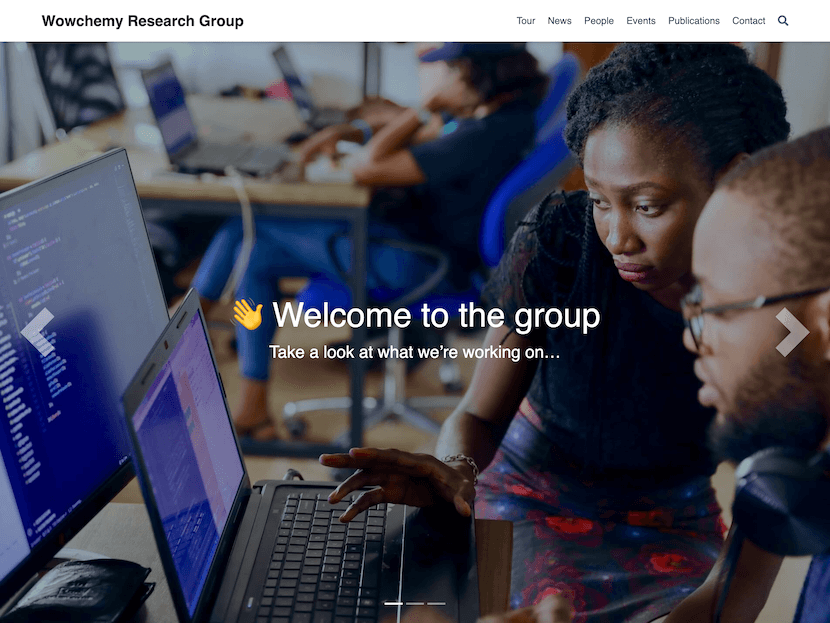

# [Hugo Research Group Theme](https://github.com/wowchemy/starter-hugo-research-group)

## Build version (October 2026)

Use **Hugo Extended 0.167.0** and Go 1.18 or newer. GitHub Pages and Netlify
are pinned to the same Hugo version. Run `hugo server` for a local preview,
or `hugo --minify` for a production build.

This site retains its existing Bootstrap layout. `go.mod` pins all HugoBlox
modules to `b8a8431ac399` (August 25, 2025), the last revision before the
Bootstrap modules moved to the
[archived legacy repository](https://github.com/HugoBlox/wowchemy-bootstrap-legacy).
The Bootstrap, core, and SEO module files are identical to that archive's
final January 2026 revision. Do not run an unqualified `hugo mod get -u`:
the current [HugoBlox Kit](https://github.com/HugoBlox/kit) uses Tailwind and
requires a separate template migration.

The upgrade preserves authored text, navigation, colors, fonts, and section order.
Compatibility edits remove three empty duplicate DOI keys and replace the
legacy project view ID `3` with its equivalent name, `card`. The Aggie profile's
internal author ID now matches its folder, preventing two pages from writing
to the same URL and removing one duplicate entry in the generated author index.
All 128 HTML page URLs are preserved. Some deprecated
APIs in the archived theme still produce warnings with Hugo 0.167.0.

## Updating recruitment

Edit `content/recruitment/index.md` for the full advertisement and its `summary`
for the short preview. The homepage and Join page both use the
`recruitment` shortcode, which reads this same page and links to `/recruitment/`.
Update this one file when positions, funding, start dates, or application
instructions change; neither preview needs a separate edit.

## Proposed lab logo

The transparent logo concept is saved at `assets/media/msce-logo-v2.png`.
It includes the full name, **Multiscale Science and Engineering Lab**, below
the MSCE wordmark. The existing website logo is retained while this concept
is reviewed. The built-in image-generation prompt is saved at
`docs/branding/msce-logo-prompt.txt`.

The **Research Group Template** empowers your research group to easily create a beautiful website with a stunning homepage, news, academic publications, events, team profiles, and a contact form.

️**Trusted by 250,000+ researchers, educators, and students.** Highly customizable via the integrated **no-code, widget-based Wowchemy page builder**, making every site truly personalized ⭐⭐⭐⭐⭐

  

Easily write technical content with plain text Markdown, LaTeX math, diagrams, RMarkdown, or Jupyter, and import publications from BibTeX.

[Check out the latest demo](https://research-group.netlify.app/) of what you'll get in less than 60 seconds, or [view the showcase](https://hugoblox.com/creators/).

The integrated [**Wowchemy**](https://hugoblox.com) website builder and CMS makes it easy to create a beautiful website for free. Edit your site in the CMS (or your favorite editor), generate it with [Hugo](https://github.com/gohugoio/hugo), and deploy with GitHub or Netlify. Customize anything on your site with widgets, light/dark themes, and language packs.

- 👉 [**Get Started**](https://hugoblox.com/hugo-themes/)
- 📚 [View the **documentation**](https://docs.hugoblox.com/)
- 💬 [Chat with the **Wowchemy research community**](https://discord.gg/z8wNYzb) or [**Hugo community**](https://discourse.gohugo.io)
- ⬇️ **Automatically import citations from BibTeX** with the [Hugo Academic CLI](https://github.com/GetRD/academic-file-converter)
- 🐦 Share your new site with the community: [@wowchemy](https://twitter.com/wowchemy) [@GeorgeCushen](https://twitter.com/GeorgeCushen) [#MadeWithWowchemy](https://twitter.com/search?q=%23MadeWithWowchemy&src=typed_query)
- 🗳 [Take the survey and help us improve #OpenSource](https://forms.gle/NioD9VhUg7PNmdCAA)
- 🚀 [Contribute improvements](https://github.com/HugoBlox/hugo-blox-builder/blob/main/CONTRIBUTING.md) or [suggest improvements](https://github.com/HugoBlox/hugo-blox-builder/issues)
- ⬆️ **Updating?** View the [Update Guide](https://docs.hugoblox.com/hugo-tutorials/update/) and [Release Notes](https://github.com/HugoBlox/hugo-blox-builder/releases)

## We ask you, humbly, to support this open source movement

Today we ask you to defend the open source independence of the Wowchemy website builder and themes 🐧

We're an open source movement that depends on your support to stay online and thriving, but 99.9% of our creators don't give; they simply look the other way.

### [❤️ Click here to become a GitHub Sponsor, unlocking awesome perks such as _exclusive academic templates and widgets_](https://github.com/sponsors/gcushen)

## Demo credits

Please replace the demo images with your own.

- [Female scientist](https://unsplash.com/photos/uVnRa6mOLOM)
- [2 Coders](https://unsplash.com/photos/kwzWjTnDPLk)
- [Cafe](https://unsplash.com/photos/RnDGGnMEOao)
- Blog posts
  - https://unsplash.com/photos/AndE50aaHn4
  - https://unsplash.com/photos/OYzbqk2y26c
- Avatars
  - https://unsplash.com/photos/5yENNRbbat4
  - https://unsplash.com/photos/WNoLnJo7tS8
