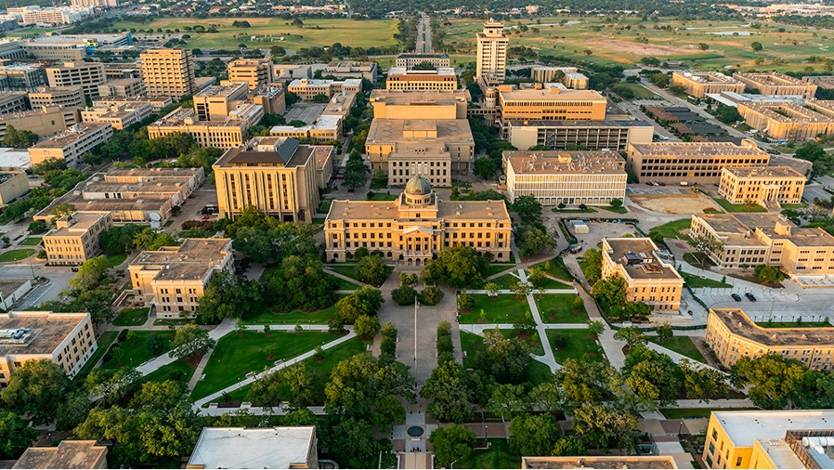



The MSCE ("Megascale") Lab aims to create an inclusive interdisciplinary research group that welcomes highly motivated students from
diverse backgrounds. The Texas A&M Engineering Program has been ranked No. 10 nationally in the latest U.S. News & World Report
rankings. The MSCE Lab is based in College Station, TX, a city that is known for its peaceful and safe environment.
College Station is conveniently located within a 1.5-hour drive to both Houston and Austin, and within a 3-hour drive to Dallas,
making it easily accessible to major cities in the region.

<!-- 

### Ph.D. Research Assistantship Position Available! 

We are recruiting one Ph.D. student to study the interactions between flow and microorganisms starting Fall 2023 or Spring 2024. Please check  here for more details. -->

### Undergraduate Students

We are always delighted to welcome undergraduate students who are interested in conducting research projects with us. We believe
that working with students can bring a fresh perspective and new ideas to our team, and we are committed to providing an inclusive
and supportive environment for all our researchers. Ideally, we are looking for students who can commit to working with us for at
least one semester. This will allow you to gain valuable experience, get involved in ongoing projects, and make a meaningful
contribution to our research goals.

If you are interested, please email your CV and a brief description of your research interests to Dr. Yao, with a subject line as
"Undergrad [your name] (replacing [Your Name] with your actual name).".

### Graduate Students

 We currently donot fully have funded RA Assistantships. 

We are actively seeking motivated graduate students from diverse backgrounds, such as environmental science and engineering, microbiology, applied mathematics, mechanical engineering, petroleum engineering, and more to join our research group. We are committed to fostering a supportive and inclusive environment for all our students and believe that diversity enriches our research endeavors.

If you are interested in pursuing graduate studies and would like to join our team, we encourage you to apply to the CEE Department's graduate program. Be sure to specify Yinuo (Noah) Yao as a potential mentor in your personal statement. 

Prospective students are also welcome to contact Dr. Yao directly to discuss opportunities. Please send your CV and a brief
description of your research interests in an email to Dr. Yao, with a subject line as
"M.S. [your name]" or "Ph.D. [your name] (replacing [Your Name] with your actual name).".

### Postdoctoral Researchers

We currently donot have funded Postdoc opportunities. However, we are continuously seeking highly motivated and passionate postdoctoral researchers to join our research team. If you are
interested in working with us, please reach out to Dr. Yao to discuss potential opportunities. To apply, please include your CV, a
brief summary of your research experience and interests, and the contact information for at least three references, with a subject line as
"Postdoc [your name]" (replacing [Your Name] with your actual name)..

### Visiting Scholars

We welcome visiting scholars who are interested in collaborating with us. Ideally, scholars will be able to visit for a minimum of
six months (preferably one year) to maximize the opportunity for collaboration and research. If you are interested in exploring the possibility of
working with us, please email Dr. Yao with a subject line as
"Visiting \<your name>".